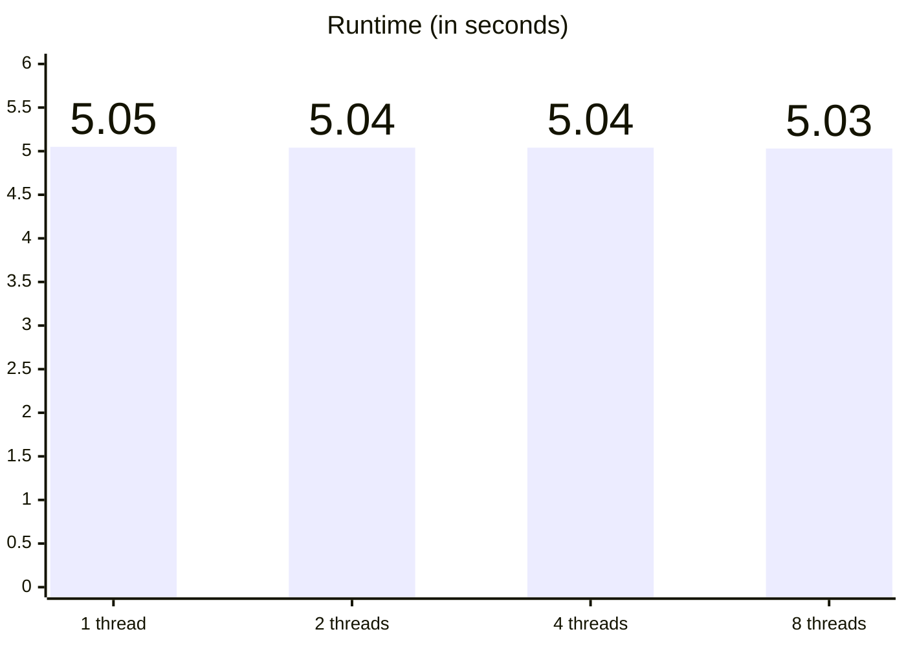
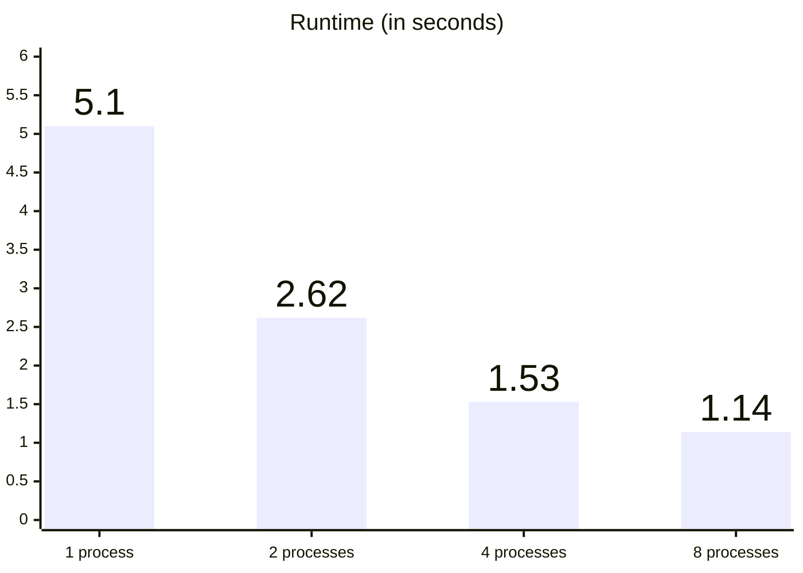

<div class="abs-br m-6 text-xl">
  <a href="https://github.com/lyubolp/talks/tree/main/01_subinterpreters_gil" target="_blank" class="slidev-icon-btn">
    <carbon:logo-github />
  </a>
</div>

<style>
</style>

---
class: text-center
---

# Threads



---
class: text-center
---

# vs processes ?



---
layout: two-cols-header
---

# Processes vs threads

::left::


::right::


<style>
img {
  padding-left: 5%;
  padding-right: 5%;
}
</style>

---

# What is the GIL?

<v-clicks>

- The **Global Interpreter Lock** is a mutex that protects access to Python objects.
- It prevents multiple native threads from executing Python bytecodes simultaneously.
- Without the GIL, reference counting (CPython's memory management) would require locks on every object.
- The GIL is released during I/O operations, allowing some concurrency.
- It was introduced to simplify CPython's implementation and integration with C extensions.

</v-clicks>

---
layout: two-cols-header
---

# Processes vs threads

::left::


::right::


<style>
img {
  padding-left: 5%;
  padding-right: 5%;
}
</style>

---

# What is a subinterpreter?


<style>
img {
  display: block;
  margin: 0 auto;
}
</style>

---

# What is a subinterpreter ?


<style>
img {
  display: block;
  margin: 0 auto;
}
</style>

---

# Example 03 - `Interpreter`

```python {all} {maxHeight: '70%', lines: true}
from concurrent import interpreters

interpreter = interpreters.create()

interpreter.exec("print('Hello from a different interpreter')")

def answer(a, b) -> int:
    return a + b

result = interpreter.call(answer, 2, 3)

print(result)

interpreter.close()
```

<br/>

```shell
$ uv run 03_interpreter.py
Hello from a different interpreter
5
```

---

# Example 04 - `prepare_main`

```python {all} {maxHeight: '70%', lines: true}
from concurrent import interpreters

interpreter = interpreters.create()

interpreter.prepare_main({"a": 42})  # Comment this line for error

interpreter.exec("print(a)")

interpreter.close()
```

<br/>

```shell
$ uv run 04_prepare_main.py
42
```

<br/>

```shell
$ uv run 04_prepare_main.py
concurrent.interpreters.ExecutionFailed: NameError: name 'a' is not defined
```

---

# Example 06 - Communication between subinterpreters

```python {all|12,15,18,21|all} {maxHeight: '65%', lines: true}
from concurrent import interpreters


def worker(queue):
    import math

    numbers = [112272535095293, 112582705942171, 115280095190773]

    for n in numbers:
        sqrt_n = int(math.floor(math.sqrt(n)))
        result = n > 1 and all(n % i != 0 for i in range(2, sqrt_n + 1))
        queue.put((n, result))


queue = interpreters.create_queue()
interpreter = interpreters.create()

t = interpreter.call_in_thread(worker, queue)

for _ in range(3):
    number, is_prime = queue.get()
    print(f"{number}: {'prime' if is_prime else 'not prime'}")

t.join()
interpreter.close()
```

<br/>

```shell
uv run 06_interpreter_communication.py
112272535095293: prime
112582705942171: prime
115280095190773: prime
```

---

# Sharing objects

<v-clicks>

- Subinterpreters **cannot** effectively share objects between themselves.
- Functions are **not shareable** when they have dependencies outside the new interpreter.
- The immutable objects are shared directly (or copied in an efficient manner):
  - `None`
  - `bool`
  - `bytes`
  - `float`
  - `int`
  - `str`
  - `tuple`
- Copying with `pickle` is used for the other objects

</v-clicks>

---


# Example 0X - numpy in subinterpreter

<!--TODO: Needs code example-->


---

# C extensions & subinterpreters

<v-clicks>

- C extensions must explicitly declare support via `Py_MOD_PER_INTERPRETER_GIL_SUPPORTED`.
- This is **separate** from free-threading's `Py_MOD_GIL_NOT_USED` — an extension can support one without the other.
- Without the declaration, importing raises a hard `ImportError` — unlike free-threading, which only warns:

```
ImportError: module numpy._core._multiarray_umath does not support loading in subinterpreters
```

- Notable packages **not yet supported**:
  - `numpy` — `InterpreterPoolExecutor` with arrays fails entirely 
  - `torch` — blocked because `_ctypes` itself doesn't declare support
  - Cython-compiled extensions (e.g. `pyarrow`, `spacy`)
  - `zstandard`

</v-clicks>

---

# What is a subinterpreter ?


<style>
img {
  display: block;
  margin: 0 auto;
}
</style>


---

# What is a subinterpreter ?


<style>
img {
  display: block;
  margin: 0 auto;
}
</style>
---

# Example 05 - `call_in_thread`

```python {all} {maxHeight: '65%', lines: true}
from concurrent import interpreters


def sleepy_print():
    print("Hello from the subinterpreter!")
    import time

    time.sleep(2)


interpreter = interpreters.create()

t = interpreter.call_in_thread(sleepy_print)

import time
time.sleep(2)

print("Hello from the main interpreter!")

t.join()

interpreter.close()
```

<br/>

```shell
$ time uv run 05_call_in_thread.py
Hello from the subinterpreter!
Hello from the main interpreter!
uv run 05_call_in_thread.py  0.04s user 0.03s system 3% cpu 2.162 total
```


---

# Example 00 — Baseline

```python {*} {maxHeight: '70%', lines: true}
import math
import sys
import time


NUMBERS = [
    112272535095293,
    112582705942171,
    112272535095293,
    115280095190773,
    115797848077099
] * 10


def is_prime(n):
    if n < 2:
        return False
    if n == 2:
        return True
    if n % 2 == 0:
        return False

    sqrt_n = int(math.floor(math.sqrt(n)))
    for i in range(3, sqrt_n + 1, 2):
        if n % i == 0:
            return False
    return True


if __name__ == "__main__":
    print(sys.version)
    start = time.time()
    for number in NUMBERS:
        is_prime(number)
    print(f"Single CPU took {time.time() - start:.2f} seconds")

```

<br/>

```shell
$ uv run 00_baseline.py
3.14.2 (main, Dec 17 2025, 21:08:09) [Clang 21.1.4 ]
Single CPU took 6.40 seconds
```

---

# Example 01 — Multiple processes

```python {all|5,15,16|all} {maxHeight: '70%', lines: true}
import math
import sys
import time

from concurrent.futures import ProcessPoolExecutor

...

if __name__ == "__main__":
    print(sys.version)
    start = time.time()

    workers = 4

    with ProcessPoolExecutor(max_workers=workers) as executor:
        executor.map(is_prime, NUMBERS)

    print(f"{workers} workers took {time.time() - start:.2f} seconds")

```

---

# Example 02 — Multiple threads

```python {all|5,15,16|all} {maxHeight: '70%', lines: true}
import math
import sys
import time

from concurrent.futures import ThreadPoolExecutor

...

if __name__ == "__main__":
    print(sys.version)
    start = time.time()

    workers = 4

    with ThreadPoolExecutor(max_workers=workers) as executor:
        executor.map(is_prime, NUMBERS)

    print(f"{workers} workers took {time.time() - start:.2f} seconds")

```

---

# Example 07 — Multiple subinterpreters

```python {all|5,15,16|all} {maxHeight: '70%', lines: true}
import math
import sys
import time

from concurrent.futures import InterpreterPoolExecutor

...

if __name__ == "__main__":
    print(sys.version)
    start = time.time()

    workers = 4

    with InterpreterPoolExecutor(max_workers=workers) as executor:
        executor.map(is_prime, NUMBERS)

    print(f"{workers} workers took {time.time() - start:.2f} seconds")

```

---
layout: center
class: text-center
---

# Performance comparison


<!-- | Workers | 1 | 2 | 4 | 8 |
|---|---|---|---|---|
| Threads | 5.05 | 5.04 | 5.04 | 5.03 |
| Process | 5.10 | 2.62 | 1.53 | 1.14 |
| Subinterpreters | 5.07 | 2.58 | 1.50 | 1.09 |

**Baseline:** 5.04 -->

---

# So, subinterpreters are the answer ?

Not quite:

1. One
2. Two
3. Three

---
class: text-center
---

<div style="display: flex; align-items: center; justify-content: center; height: 100%;">

# GIL-less (Freethreaded) Python

</div>


---

# Freethreaded Python

<v-clicks>

- Freethreaded Python removes the GIL entirely (PEP 703).
- Consequences to be aware of:
  - **Thread safety** — objects that were previously safe due to the GIL may no longer be.
  - **Immortalization** — some objects are made immortal to avoid reference-count contention.
  - **Iterators** — may not be thread-safe without explicit locking.
  - **Single-threaded performance** — slightly slower due to per-object locking overhead.

</v-clicks>


---

# Setting up freethreaded Python

<v-clicks>

- When using `uv`, setting up a freethreaded version of Python is simple:
  - `uv python install 3.14t`, followed by `uv python pin 3.14t`. (To revert back: `uv python pin 3.14`)
- When using the installer, when customizing the installation, use the "Free-threaded Python" option
</v-clicks>


---

# Packages that don't work with freethreaded Python

<v-clicks>

- Pure-Python wheels already work in free-threaded builds.
- Wheels with C extensions need to be updated.
- Notable packages **not yet supported**:
  - `psycopg2-binary`
  - `psycopg-binary`
  - `tokenizers`
  - `opencv-python`
  - `spacy`

</v-clicks>

---

# Benchmark with freethreaded Python

| Workers | 1 | 2 | 4 | 8 |
|---|---|---|---|---|
| Threads | 5.05 | 5.04 | 5.04 | 5.03 |
| Threads (No GIL) | 4.91 | 2.69 | 1.66 | 1.55 |
| Process | 5.10 | 2.62 | 1.53 | 1.14 |
| Process (No GIL) | 4.92 | 2.74 | 1.72 | 1.33 |
| Subinterpreters | 5.07 | 2.58 | 1.50 | 1.09 |
| Subinterpreters (No GIL) | 5.05 | 2.79 | 1.76 | 1.36 |

**Baseline:** 5.04

---

# Library support

| Library | Free-Thread Readiness | Key Opportunity | Key Risk |
|---|---|---|---|
| **Django** | Low — no thread-safety audit done yet | CPU-bound views gain true parallelism; async views benefit more | ORM `save()` races, lazy translation state, thread-local DB connections under higher concurrency |
| **Gunicorn** | Low — no targeted support yet | `gthread` workers could gain true CPU parallelism | Gains not materializing at thread level yet; use workers instead |
| **NumPy** | Medium-High — experimental support since 2.1 | Parallelizing Python-side orchestration code | Mutating shared arrays can crash the interpreter; `dtype=object` is especially dangerous |
| **PyTorch** | Medium — 3.13t wheels available | Parallel inference, fixing `DataParallel`, threaded `DataLoader` | `torch.compile` is broken; dependency chain (PyO3/Cython) problematic |

<style>
  table {
    font-size: 0.9em;
  }
</style>

---

# Summary

<v-clicks>

- **Processes** — isolated, bypass the GIL, but heavyweight.
- **Threads** — lightweight, but blocked by the GIL (CPU-bound tasks don't scale).
- **Subinterpreters** — in-process isolation with a per-interpreter GIL; best of both worlds.
- **Freethreaded Python** — removes the GIL; threads scale for CPU-bound work, but ecosystem support is still catching up.

</v-clicks>
